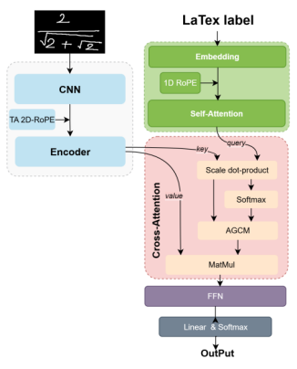
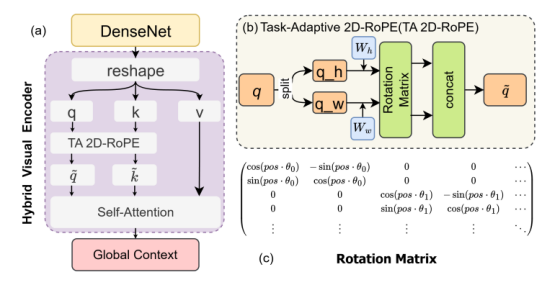
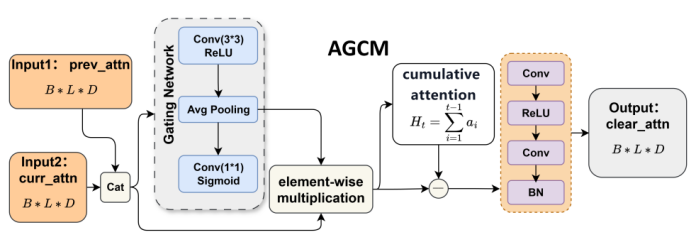

## DAT-former
Pytorch Implementation of "Enhancing Handwritten Mathematical Expression Recognition with Hybrid Encoding and Disentangled Attention Mechanisms"

<table align="center">
  <tr>
    <!-- 左图 -->
    <td>
      
    </td>
    <!-- 右侧两张上下排列 -->
    <td>
      <br><br>
      
    </td>
  </tr>
</table>

<table align="center">
  <tr>
    <!-- 左图 -->
    <td>
      
    </td>
    <!-- 右侧两张上下排列 -->
    <td>
      <br><br>
      
    </td>
  </tr>
</table>


## Abstract
Handwritten Mathematical Expression Recognition (HMER) is a crucial technology for converting handwritten formulas into machine-readable formats, with wide applications in digital education and scholarly communication. While the dominant CNN-Transformer architecture has shown promise, it suffers from two fundamental bottlenecks: the inefficiency of CNNs in modeling long-range dependencies due to their local receptive fields, and signal conflicts in coverage mechanisms caused by heterogeneous attention. To overcome these dual challenges, this paper introduces DAT-Former, a novel architecture featuring two synergistic innovations: a globally-aware hybrid encoder with a task-adaptive 2D Rotary Position Embedding (2D-RoPE) to explicitly capture spatial topology, and an Adaptive Gated Coverage Module (AGCM) that uses a data-driven gate to resolve attention conflicts. Extensive experiments demonstrate state-of-the-art recognition rates of 63.86%, 60.51%, and 64.89% on CROHME 2014/16/19, respectively, and exceptional generalization on HME100K. This work highlights that a carefully designed sequence-to-sequence paradigm can rival more complex tree-based approaches, setting a new benchmark for robust HMER.

## 方法概述


## 目录概览

以下为仓库目录：

- `config.yaml` — 默认配置文件（训练/数据/模型等参数）。
- `train.py` — 训练入口脚本。
- `requirements.txt` — Python 依赖。
- `dat_formmer/` — 模型、数据模块、工具代码。
	- `datamodule/` — 数据集加载与变换代码。
	- `model/` — encoder/decoder/transformer 等模型实现。
	- `utils/` — beam search、生成工具等。
- `convert2symLG/` — 数据格式转换与工具脚本（mml/lg/symlg 等）。
- `lgeval/` — LgEval 评估工具集（用于与标准评测脚本配合计算指标）。
- `lightning_logs/` — 训练时的日志与 checkpoint（由 PyTorch Lightning 产生）。

## 快速开始（快速复现）

本项目运行平台为Ubuntu20.04

1) 创建并激活虚拟环境（可选但推荐）

```powershell
conda create -n datformer python=3.9
```

2) 安装依赖

```powershell
pip install -r requirements.txt
```

3) 准备数据（示例）

仓库附带 `data.zip`（或请自行放置 CROHME 数据）。默认使用 CROHME 2014 数据集。如果你使用的是 2016/2019 或自定义数据集，请在 `config.yaml` 中修改路径与数据选项。

（假设解压后数据路径为 `data/crohme2014/`，可在 `config.yaml` 中将 dataset.path 指向该路径。）

4) 启动训练

```powershell
python train.py --config config.yaml
```

训练过程会在 `lightning_logs/` 下保存日志与 checkpoint（取决于 `config.yaml` 中的 logger/checkpoint 配置）。

5) 评估

仓库提供了评估脚本 `eval_all.sh`（UNIX shell）和 `lgeval/` 工具。Windows 用户可使用 WSL 或在 PowerShell 下运行相应的脚本。

```powershell
sh eval_all.sh
```


## 数据说明

- 支持的数据集：CROHME（2014/2016/2019）、HME100K。仓库默认配置使用 CROHME2014 数据集。
- 数据格式：代码支持 CROHME 数据集为 zip 格式，解压后为标准的 CROHME 数据格式。
- 数据路径：在 `config.yaml` 中指定 `dataset.path`，默认为 `data/crohme2014/`。
- 数据预处理：仓库使用 `dat_formmer/datamodule/datamodule.py` 来加载和解码数据。
- 数据下载：仓库附带 `data.zip`为CROHME数据集，HME100K 数据集请自行下载，[HME100K数据集链接](https://github.com/Phymond/HME100K)


注意：如果你的数据不是严格的 CROHME 格式，需要对数据进行转换，或者修改 `dat_formmer/datamodule/datamodule.py` 中的数据读取逻辑以匹配你的标注结构。


## 配置说明

`config.yaml` 包含模型、优化器、数据路径、训练超参等。

常见字段（示例说明）：
- `trainer`：训练参数。
- `model`：模型参数。
- `data`：数据参数。

在开始训练前请打开并检查 `config.yaml`，确保 `zipfile_path` 与本地数据一致。

## 检查点与日志

- 默认使用 PyTorch Lightning 保存训练日志与 checkpoint，目录为 `lightning_logs/`。
- checkpoint 文件通常包含模型权重与训练状态，可用于恢复训练或推理。

恢复训练示例：在 `config.yaml` 或 `train.py` 中指定 `resume_from_checkpoint`（或传入命令行参数）为相应的 checkpoint 路径。


## 评估指标

- scripts/test/test.py：评估脚本，支持多种数据集与评估指标。
- eval_all.sh：评估脚本，用于计算 CROHME 2014/2016/2019 的指标。
- 评估代码可计算ExpRate\≤1\≤2\≤3Error，并在`lightning_logs/version_` 下保存结果。
